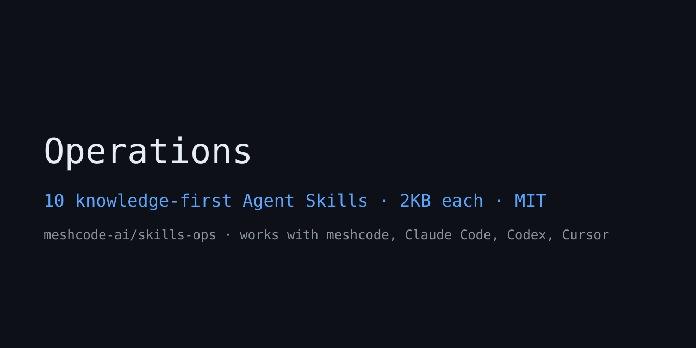

# meshcode-ai/skills-ops

Business operations skills for Claude Code, Codex, Cursor — process mapping, SOP building, capacity planning, procurement, vendor management, internal comms, knowledge ops, meetings, project planning, and compliance checklists. 10 knowledge-first agent skills in Korean, distilled from MIT-licensed operations playbooks (alirezarezvani/claude-skills business-operations v2.8.0, Grove, Kotter, Prosci, PMBOK). Use them with meshcode desktop, Claude Code, Codex, Cursor, or any Agent Skills-compatible runtime for BizOps, COO direct-report, and operations-lead workflows.

## Install

Download the zip → extract into your project's `.meshcode/skills/` (keep the flat layout). Automatically exposed from the next session onward.

## TOC

- [Who this is for](#who-this-is-for)
- [Skills](#skills)
- [Role separation](#role-separation)
- [Hub & sibling repos](#hub--sibling-repos)
- [Use with meshcode](#use-with-meshcode)

## Who this is for

- **BizOps lead / COO direct report** — operations owners who must control process, capacity, vendor, and document sprawl with numbers as the team grows
- **Scale-up ops team** — people who need to prioritize what to fix first in orgs with 80–200 SaaS tools, clustered renewals, and 600-page wikis
- **Solo operators / founders** — entrepreneurs who want to replace hiring, meetings, announcements, and SOPs with systems to cut repetitive judgment
- **AI agent operators** — users who want to equip Claude Code / Codex / Cursor with operational judgment (bottlenecks, utilization, risk)

## Skills

| Skill | Description summary |
|---|---|
| `ops-process-mapper` | BPMN swimlane mapping of work flow, VA%·Little's Law, top-3 bottleneck extraction. "process map", "bottleneck" |
| `ops-sop-builder` | Authoring executable SOPs/runbooks — 5W2H, observable success signals and rollback. "SOP", "standard procedure", "runbook" |
| `ops-capacity-planner` | Headcount sizing for queue-processing orgs — utilization bands, P90, shrinkage, hiring sequence. "capacity planning", "utilization", "headcount" |
| `ops-procurement` | Spend classification·Pareto, duplicate SaaS consolidation, renewal calendar. "spend audit", "SaaS audit", "procurement" |
| `ops-vendor-management` | 5-dimension vendor scorecards, SLA credits, 4-vector risk, KEEP/REVIEW/REPLACE. "vendor scorecard", "TPRM" |
| `ops-internal-comms` | Reorg·rollout announcement packages — ADKAR·Kotter, manager cascade, 5–7 touchpoints. "announcement", "internal announcement" |
| `ops-knowledge-ops` | Wiki hygiene — orphan/stale/terminology-drift audits, 6-element runbook validation, TOP20 cleanup. "wiki audit", "documentation cleanup" |
| `ops-meetings` | Meeting type decision·agenda conventions·culling criteria, DRI·decision reconciliation. "meeting agenda", "retro" |
| `ops-project-planning` | WBS·critical path·10–15% integration buffer, RACI, RAID log. "project plan", "WBS", "milestone" |
| `ops-compliance-checklist` | Control matrix·evidence plans·audit-readiness judgment. "compliance checklist", "SOC 2", "compliance" |

## Role separation

- **Flow vs document**: `ops-process-mapper` draws the *flow* of work (where it waits), while `ops-sop-builder` writes the *document* executors read (how it's done). Both apply to the same process, but the artifacts differ.
- **New documents vs cleanup**: `ops-sop-builder` is about writing anew; `ops-knowledge-ops` is about deciding what to fix in an already-600-page wiki.
- **Sourcing decisions vs performance evaluation**: `ops-procurement` decides *which vendor to deal with* (spend, consolidation); `ops-vendor-management` scores *the performance of vendors you keep paying*.
- **Headcount vs schedule**: `ops-capacity-planner` sizes staff against steady-state queue throughput; `ops-project-planning` handles deadline-bound task schedules.
- **Announcements vs meetings**: `ops-internal-comms` is one-way broadcast (announcements); `ops-meetings` handles the cost and form of two-way decisions.

## Hub & sibling repos

- Hub catalog: [meshcode-ai/skills](https://github.com/meshcode-ai/skills) — index of skills across all domains
- Sibling: [meshcode-ai/skills-seo](https://github.com/meshcode-ai/skills-seo) — 7 SEO/AEO skills
- Sibling: [meshcode-ai/skills-marketing](https://github.com/meshcode-ai/skills-marketing) — 20 marketing skills
- Sibling: [meshcode-ai/skills-copy](https://github.com/meshcode-ai/skills-copy) — 10 copy/content skills

## Use with meshcode

These skills are built for [meshcode](https://meshcode.ai) (free download — macOS/Windows):

1. Open your project in meshcode
2. In chat, ask **"show available skills"**, then **"install the operations skills"** — meshcode fetches from this repo automatically, no git or terminal needed
3. They appear in the next session and load only when a task matches, so installing all of them stays cheap

Manual alternative: download this repo's zip and extract into your project's `.meshcode/skills/`. Also works in Claude Code (`~/.claude/skills/`), Codex, and Cursor.

